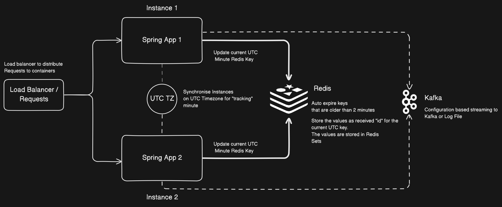

# Thought Process and Implementation Overview



## Overview

In this challenge, the goal was to implement a system which can track the count of unique received IDs within each minute, and provide configurable options to store the count either in logs or stream the data to a distributed service. 


The application is fully scalable, and can work in a distributed environment, and can support a high number of requests throughput, due to the design implementations.

### High Level Design
- The app is a Java based application which uses Spring Boot to expose API endpoints ```/api/verve/accept``` which accepts an integer ```id``` as a query parameter and also accepts optional ```endpoint``` parameter, which is used to submit the count of unique received requests in the current minute. Basic error handling on the endpoints is done to accept valid inputs only.
- When a request comes to the endpoint, the parameters are passed, and sent to the ```RequestProcessorService``` which then creates a Redis Key based on the current UTC time
- The current UTC time is same for multiple instances, so any request coming from a load balancer on any instance will produce the same key for the current UTC minute
- Then, for the same key, a Redis Set is used to add the id parameter to the set. Since Redis sets work like conventional Sets, there are no duplicates, even if multiple instances store the same id in the same redis key
- This way, the system ensures that even if duplicate Ids are received on any instance, in the current minute, they get updated in the Redis Set and de-duplicated.
- Each Redis key is set to a TTL of 2 minutes so that even in case of a large number of requests, the Redis container will not run into memory or storage issues
- The application uses a configuration file ```application.properties``` to configure where to write the unique counts received by the application , or stream the same.  
- The application also provides support for Kafka based streaming


### Low level Design

- The Spring boot application has a ```controller``` package that has a ```Endpoint``` Controller file which exposes the API
- It does basic validation on the request parameters, ```id``` is required and ```endpoint``` is an optional parameter
- Validations are done using custom Spring Validators present in the package ```validators```
- Upon successful validation, the request is submitted to the ```RequestProcessorService``` inside ```service``` package
- The service uses ```RedisTemplate``` which is a part of ```SpringData Redis``` for executing commands on the redis container
- The method ```acceptRequest``` accepts the integer id and the endpoint, creates a Redis key for the current ```UTC``` time in the format ```req:hh:mm``` and stores the id for the same key, which is a ```RedisSet```
- A TTL of 2 minutes, is added on the same key, assuming two cases:
  - If only one request comes at the starting second of the current minute, the TTL will be 2 minutes from the starting second, thus the count processors (explained below) will still be able to access this key to log or stream this information
  - If a request comes at the end of the second of the current minute, the TTL gets updated to again 2 minutes. This is because, every update to the key will also update the TTL. So at maximum, the current minute's key will retain in Redis for a total of 3 minutes, starting from the key creation time
- If the optional endpoint is provided, the application attempts to make a ```GET``` or a ```POST``` request based on the configuration (by default it is a GET) to the endpoint with the count of the requests for the current minute.
- The count is extracted using the ```size``` method on the key by calculating the current utc time
- Every minute, a Spring Boot CRON expression runs a method that is configured to run on every minute in the UTC time zone, either logs the count of the requests received in the minute, or streams it to Kafka, depending upon the configuration. By default, it is set to Log on every minute in the UTC timezone, but can be configured to stream the count to kafka

### Testing Steps

- Please take a clone of the repository and follow the below steps to test the application
- I have provided a ready to run docker compose file ```docker-compose.yml``` that can be used to spin up 2 instances of the application, along with Redis and Kafka containers
- The compose file exposes configuration variables through the ```environment``` property and sets some defaults on each of the application.
- By default, ```APP_COUNT_SUBMITTER_TYPE``` is set to ```POST``` (also supports GET) which means that it will use POST extension to submit the endpoint with the count
- ```APP_COUNT_PROCESSOR_TYPE``` is set to Kafka (also supports log), which will stream the counts to the kafka container
- To run the docker compose file, simply run ```docker-compose up --build ``` command, it will build the image from current Dockerfile
- To test the APIs, I have provided a postman_collection.json which has the endpoints for the two instances
- An executable jar file is also added


